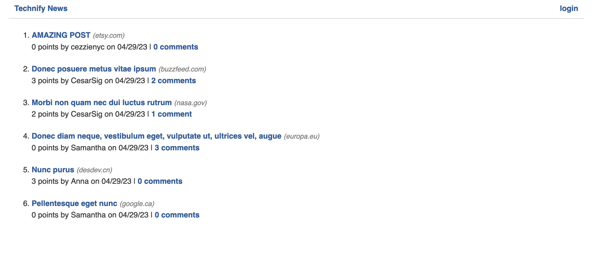
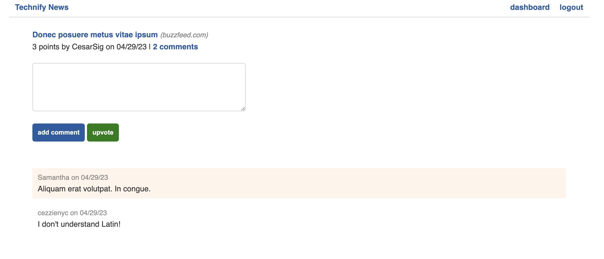
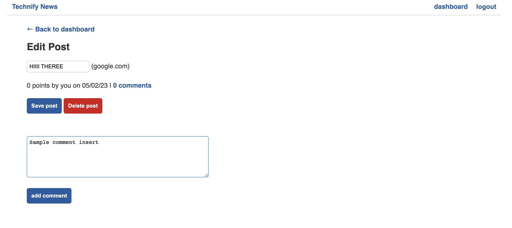

# Technify-In-Python

This social media app is a python version of my node.js project Just Tech News, a platform for developers to post, share, comment, and upvote on popular tech news.

Original Node.js project github here:
https://github.com/cesarsiguencia/just-tech-news 

### Credentials
Sample the application using these test credentials.
- Username: testbot@gmail.com 
- Password: password

### Link
https://technify-by-cs.up.railway.app/

* Login using their email and password used at the time of signing up
* Create posts
* Comment on any posts
* Upvote on any posts
* Change title of their created posts through the 'DASHBOARD'
* Delete a post and it's associated comments and upvotes through the 'DASHBOARD"

Non users (the general public, VIEW MODE) are able to
* Sign up using their email, password, and a unique username to gain all previously stated user privileges
* See all posts from all users at the homepage along with number of points (upvotes) and comments per posts while remaining logged out
* Read all associated comments and their authors per post by clicking on the post while remaining logged out

To create an account and contribute, click on the link below and navigate to 'Login' at the upper right corner to sign up. Note: Your email will NOT be used for any other purposes other than for the sign up.
To create your own copy of this application instead of using the link, please check installation instructions at the bottom.

### Technologies Used
* Python
* Flask
* MySQL with PyMySQL
* SQLAlchemy ORM
* Bcrypt
* Dotenv
* Gunicorn
* JavaScript

### Tables/Models in Database
* Users
* Posts
* Comments
* Votes

Installation to Local Drive with Accompanying Data (Seeds)
1. Git clone or download the application and load on VSCode
2. Open your command line, go to the application directory root, and load a virtual environment by running ‘python -m venv venv’. This will create a new venv for your virtual environment info to be stored.
3. Run ‘source venv/bin/activate to initialize virtual environment session. Type ‘deactivate’ at any time to end it
4. With the virtual environment running, python dependencies can now be installed. Run ‘pip install -r requirements.txt’.
5. If this is your first time installing MySQL, please navigate to their documentation for proper installation into your computer and credential creation.
6. Open the MySQL shell and run ‘CREATE DATABASE python_news_db’. Then quit the shell.
7. Create an .env file at the root and have one variable named ‘DB_URL’ written with your value being your MySQL credentials included as a URL. For example: DB_URL=mysql+pymysql://root:<password>@localhost/python_news_db (Make sure the start of your url has BOTH mysql and pymysql as mysql+pymysql)!
8. Run your data seeds with the command ‘python seeds.py’
9. Run the command ‘python main.py’  and load http://127.0.0.1:4999 in the browser.

### Screenshots

